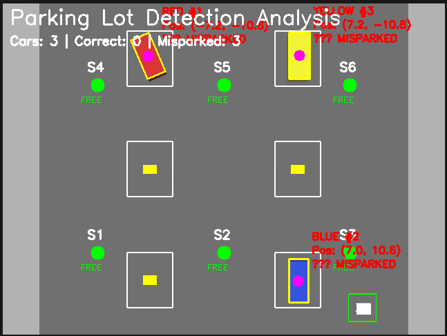
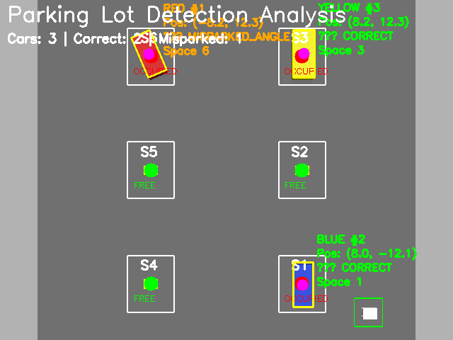
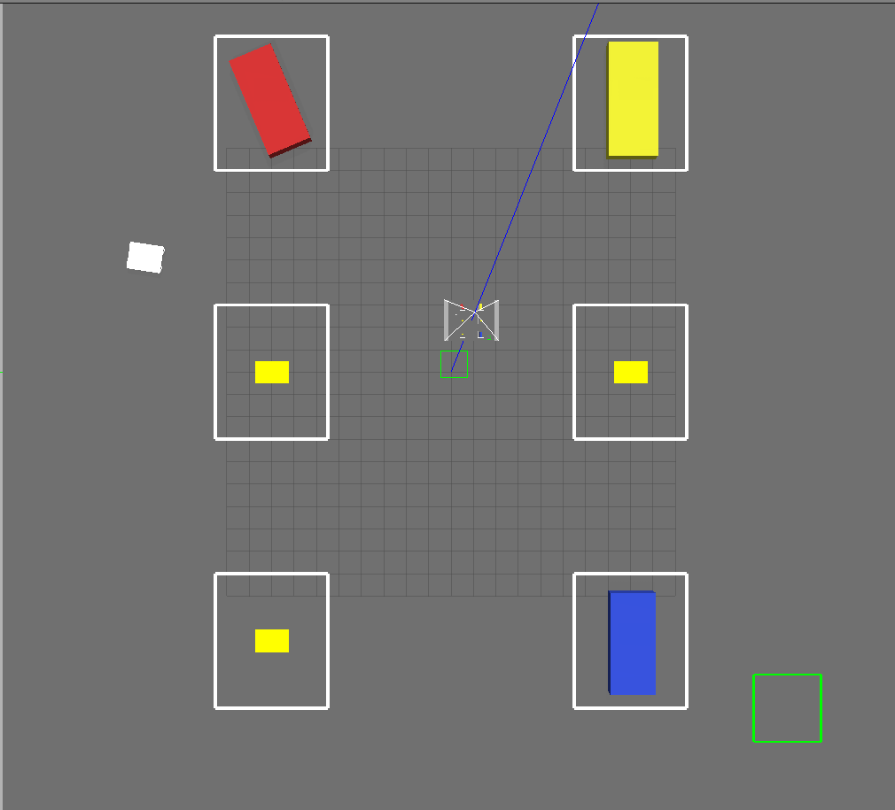
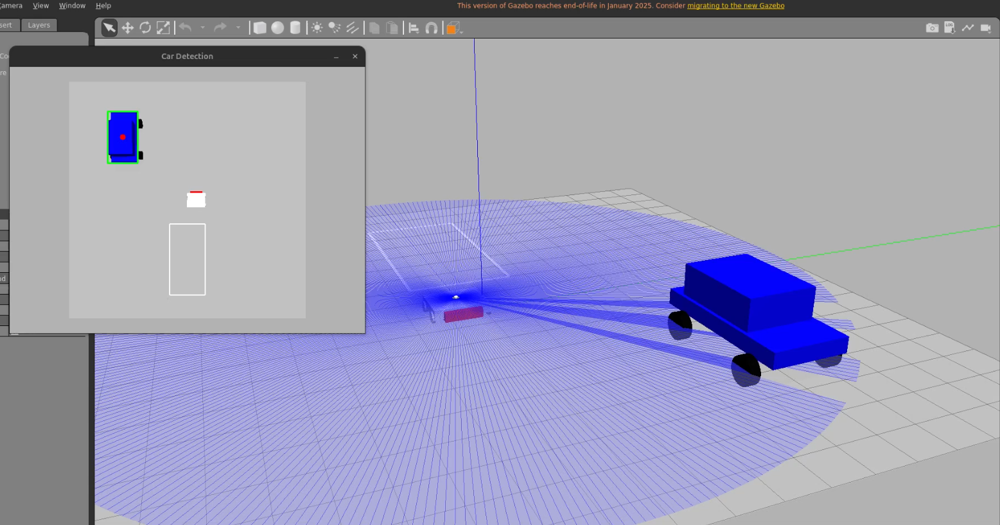
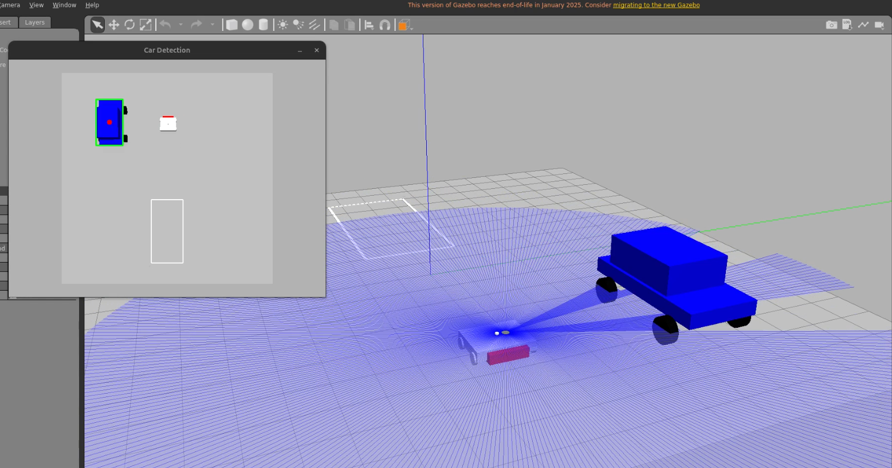
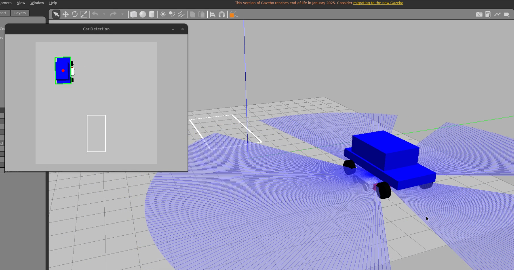
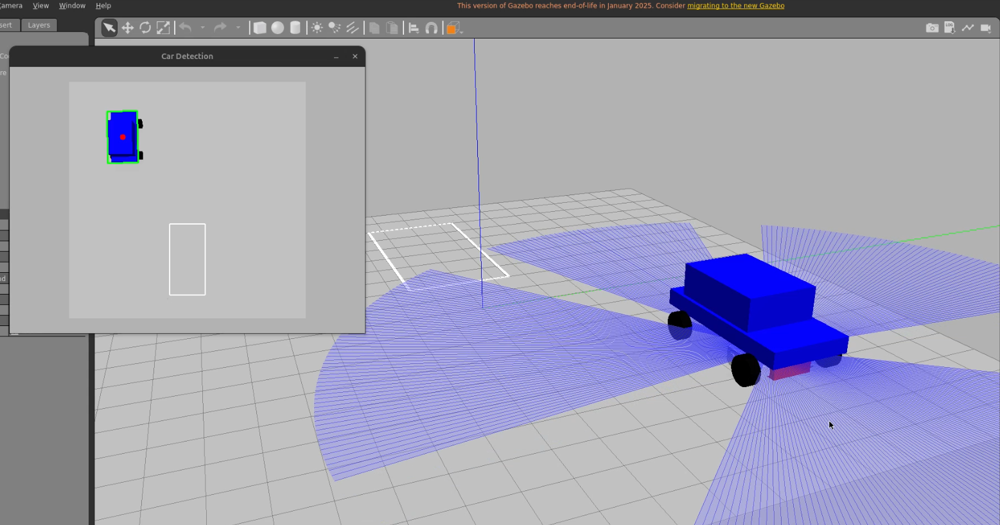
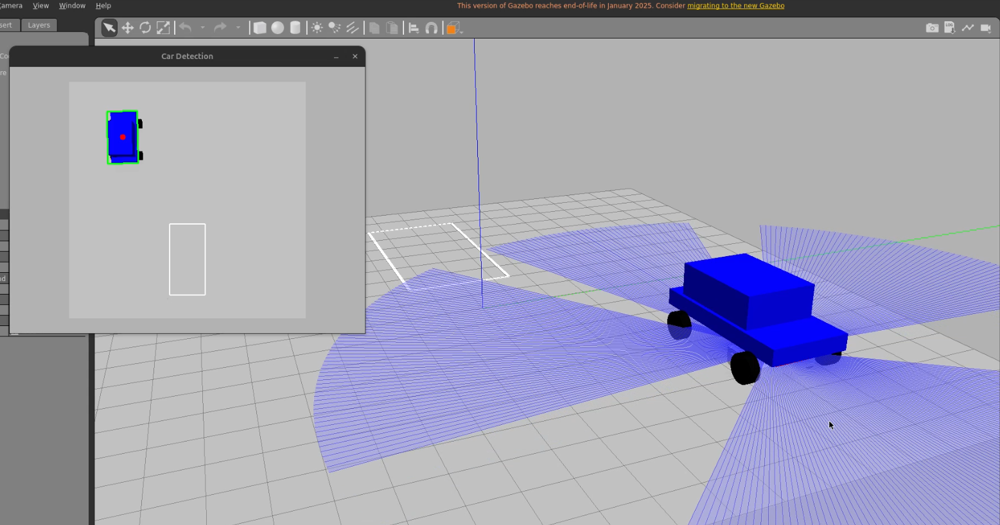

# Autonomous Car Parking Bot

ROS 2 Humble implementation of autonomous parking management system for indoor facilities.

## Overview
This project implements a two-workspace system for autonomous parking management:
- **Workspace 1**: Overhead camera detection with Nav2 navigation (40m×40m parking lot)
- **Workspace 2**: Towing robot with lifting mechanism (20m×20m environment)

---

## Demo Videos

### 🎥 Full System Demonstrations

**Workspace 1: Detection & Navigation**  
📹 [Watch Demo Video](Screen%20Recordings/ws1.mp4)

**Workspace 2: Towing Robot with Lift**  
📹 [Watch Demo Video](Screen%20Recordings/ws2.mp4)

---

## Features
- ✅ OpenCV-based vehicle detection with coordinate transformation
- ✅ Nav2 navigation with obstacle avoidance
- ✅ Manhattan-style precise approach navigation
- ✅ ros2_control lift mechanism
- ⚠️ Trajectory planning framework (Li et al. 2022)

## Requirements
- Ubuntu 22.04
- ROS 2 Humble
- Gazebo 11
- Python 3.10+
- OpenCV
- Nav2 navigation stack

---

## Installation & Usage

### Workspace 1: Detection & Navigation

#### Setup
```bash
cd ws1
colcon build
source install/setup.bash
```

#### Launch Options

**Option 1: Full System (Detection + Nav2)**
```bash
ros2 launch parking_lot_sim parking_nav.launch.py
```

**Option 2: Detection Only**
```bash
ros2 launch parking_lot_sim parking_lot.launch.py
```

#### System Demonstration

<table>
<tr>
<td width="50%">

**Parking Lot Environment**


*40m×40m environment with 6 parking spaces*

</td>
<td width="50%">

**Detection System**



*Real-time vehicle detection with status classification*

</td>
</tr>
<tr>
<td width="50%">

**Correct Detection**



*All vehicles correctly parked and identified*

</td>
<td width="50%">

**Misparked Detection**


*System detects 90° orientation mismatch*

</td>
</tr>
<tr>
<td width="50%">

**Wrong Camera Pitch (Before Fix)**


*Misaligned detection due to coordinate issue*

</td>
<td width="50%">

**Wrong Camera Pitch (Before Fix)**


*Shows the X-Y swap problem*

</td>
</tr>
<tr>
<td width="50%">

**Navigation Path Planning**


*Robot planning path to misparked vehicle*

</td>
<td width="50%">

**Goal Reached**



*Successfully reached approach position*

</td>
</tr>
</table>

---

### Workspace 2: Towing Robot

#### Setup
```bash
cd ws2
colcon build
source install/setup.bash
```

#### Launch
```bash
ros2 launch towing_sim towing.launch.py
```

#### Towing Sequence

<table>
<tr>
<td width="33%">

**Initial Position**



*Robot at starting position with overhead camera view*

</td>
<td width="33%">

**Approaching Car**



*Manhattan navigation toward vehicle*

</td>
<td width="33%">

**Getting Closer**



*Adaptive speed control as distance decreases*

</td>
</tr>
<tr>
<td width="33%">

**Fine Positioning**



*Precise alignment phase*

</td>
<td width="33%">

**Under Vehicle**



*Robot positioned at towing location*

</td>
<td width="33%">

**Overhead View**


*Camera shows successful positioning*

</td>
</tr>
<tr>
<td width="33%">

**Camera Monitoring**


*Detection system tracks both robot and car*

</td>
<td width="33%">

**Final Position**


*Ready for lift sequence*

</td>
<td width="33%">

*Lift mechanism demonstration in video*

</td>
</tr>
</table>

---

## Technical Highlights

### Phase 1: Detection System
- **HSV color segmentation** for red, blue, yellow vehicles
- **Coordinate transformation** handling 90° camera pitch
- **Sub-degree accuracy** (±0.1°) for orientation detection
- **Parking status classification** (correct/misparked by angle/position)

**Key Challenge Solved:** Camera rotation causes X-Y axis swap
```python
# Solution implemented
world_x = pixel_y * scale
world_y = -pixel_x * scale
```

### Phase 2: Navigation System
- **Nav2 stack** with DWB controller (mecanum drive)
- **Static occupancy grid** at 5cm resolution
- **Obstacle avoidance** with 0.5m inflation radius
- **Transform tree:** map → odom (static) → base_link → camera_link

### Phase 3-4: Towing Robot
- **Manhattan navigation** with sequential X-then-Y movement
- **Adaptive speed:** 2.0 → 0.5 → 0.2 m/s based on distance
- **ros2_control** position controller for lift (0-0.35m)
- **Extreme friction** (μ = 10¹²) for simulation attachment

### Phase 5: Trajectory Planning
- **Li et al. (2022)** optimization-based approach
- **Corridor construction** for collision-free paths
- **Status:** Algorithm implemented, awaiting robust towing mechanism

---

## Project Structure
```
├── README.md
├── Screenshots/
│   ├── ws1/                      # Detection & Navigation screenshots
│   └── ws2/                      # Towing robot screenshots
├── Screen Recordings/
│   ├── ws1.mp4                   # WS1 demo video
│   └── ws2.mp4                   # WS2 demo video
├── ws1/                          # Workspace 1
│   └── src/
│       └── parking_lot_sim/      
│           ├── launch/
│           │   ├── parking_lot.launch.py
│           │   └── parking_nav.launch.py
│           ├── parking_lot_sim/
│           │   ├── smart_detector.py
│           │   ├── goal_publisher.py
│           │   └── map_generator.py
│           ├── worlds/
│           ├── urdf/
│           └── config/
└── ws2/                          # Workspace 2
    └── src/
        ├── parking_lot_sim/      # Detection (shared)
        └── towing_sim/
            ├── launch/
            │   └── towing.launch.py
            ├── towing_sim/
            │   └── towing_controller.py
            ├── urdf/
            └── config/
```

---

## System Capabilities

| Feature | Status | Performance |
|---------|--------|-------------|
| Vehicle Detection | ✅ Complete | ±0.1° orientation, ±10cm position |
| Coordinate Transform | ✅ Complete | 90° pitch compensation working |
| Nav2 Navigation | ✅ Complete | 100% success rate in tests |
| Manhattan Approach | ✅ Complete | ±10cm positioning accuracy |
| Lift Mechanism | ✅ Complete | Static attachment successful |
| Trajectory Planning | ⚠️ Partial | Algorithm ready, needs robust towing |
| Dynamic Towing | ❌ Incomplete | Friction approach insufficient |

---

## Known Limitations

- **Friction-based towing:** Works only in static scenarios, not during motion
- **Color-based detection:** Limited to red, blue, yellow vehicles
- **Static environment:** No dynamic obstacle handling
- **Simulation only:** Requires mechanical attachment for real hardware
- **Single vehicle:** Sequential processing, no parallel operation

---

## Future Work

1. **Complete Towing System**
   - Implement gazebo_ros_grasp_fix plugin
   - Test trajectory planning with attached vehicle
   - Validate placement accuracy

2. **Enhanced Detection**
   - Integrate YOLO/Mask R-CNN for any vehicle type
   - Remove color dependency

3. **Real-World Deployment**
   - Hardware implementation with physical robots
   - Real camera and lidar integration
   - AMCL localization for real environments

4. **Multi-Robot Coordination**
   - Task queue management
   - Parallel processing of multiple vehicles

---

## Development Timeline

- **Phase 1 (Detection):** 2 weeks - Solved coordinate transformation challenge
- **Phase 2 (Navigation):** 2 weeks - Nav2 configuration and parameter tuning
- **Phase 3 (Approach):** 1 week - Manhattan navigation implementation
- **Phase 4 (Lift):** 2 weeks - ros2_control integration, physics tuning
- **Phase 5 (Trajectory):** 1 week - Algorithm implementation (towing incomplete)

---

## Authors

**Apurv Kushwaha** - kushw009@umn.edu  
*Detection System, Coordinate Transformations, Trajectory Planning*

**Rutav Narkhede** - narkh003@umn.edu  
*Navigation System, Towing Robot, Lift Mechanism*

**Course:** CSCI 5551 - Introduction to Robotics and Intelligent Systems  
**Institution:** University of Minnesota  
**Semester:** Fall 2024

---

## Citation
```bibtex
@misc{kushwaha2024parking,
  author = {Kushwaha, Apurv and Narkhede, Rutav},
  title = {Autonomous Car Parking Bot: ROS 2 Implementation},
  year = {2024},
  publisher = {GitHub},
  url = {https://github.com/ApurvK032/Autonomous-Car-Parking-Bot}
}
```

---

## License

MIT License

---

## Acknowledgments

- Nav2 Team for the navigation stack
- Open Robotics for ROS 2 and Gazebo
- Li et al. for trajectory planning framework
- CSCI 5551 Teaching Staff for guidance

---

**⭐ If you find this project useful, please star the repository!**
